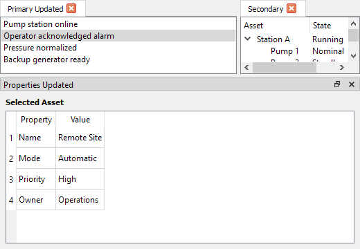
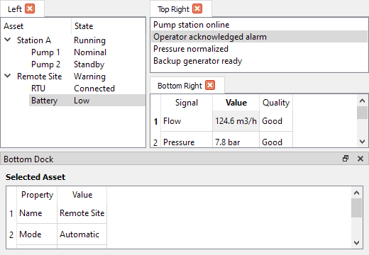

# ViewManagerQt

Standalone Qt widget layout manager used to arrange application views as dock
widgets, tab groups, and split tab panes.

## Screenshots




## CMake

Add this directory to `CMAKE_MODULE_PATH`, then use:

```cmake
find_package(ViewManagerQt REQUIRED)

target_link_libraries(my_target PRIVATE
  view_manager_qt
)
```

The package defines:

- `view_manager_qt`
- `ViewManagerQt::view_manager_qt`

## Requirements

- CMake 3.25 or newer
- C++20
- Qt5 Widgets

## Updating Golden Screenshots

The integration tests compare rendered widget output against golden images in
`testdata/`. To update screenshots after an intentional visual change:

1. Delete the outdated image from `testdata/`
2. Run `view_manager_qt_unittests`
3. Verify the generated image
4. Commit the updated image

When comparison fails, the actual output is saved as `testdata/actual_*.png`.

## License

MIT. See [LICENSE](LICENSE).
